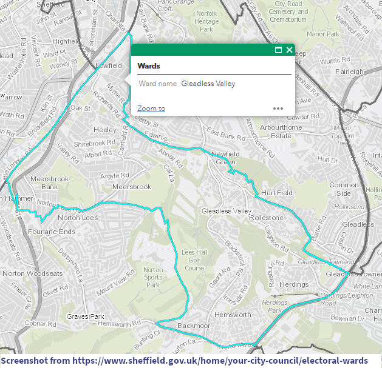

```{r, include = FALSE, message = FALSE}
knitr::opts_chunk$set(
  collapse = TRUE,
  comment = "#>",
  fig.path = "images/"
  # out.width = "100%"
)


library(here)
library(readr)
library(dplyr, warn.conflicts = FALSE)
library(stringr)
library(janitor)
library(jogger)
library(sf)
library(tmap)
library(leaflet)
library(leaflet.extras)
library(htmlwidgets)

source(here("R", "data-prep.R"))

```

## `r readLines(here::here("DESCRIPTION")) %>% stringr::str_subset("^Description") %>% stringr::str_extract("(?<=: ).*")`

<!-- author: Fran Barton <fbarton@alwaysdata.net> -->

Start date: 2021-02-11

<!-- Latest update: `r Sys.Date()` -->


<!-- badges: start -->
<!-- badges: end -->

### Within Sheffield City:

* [People Keeping Well (PKW) partnerships](https://sheffieldcc.maps.arcgis.com/apps/webappviewer/index.html?id=1099534e5862409c9f69989b744aa0ae) (*n* = 16)
* City Council Neighbourhoods (*n* = 100)
* [CCG Neighbourhoods](https://www.sheffieldccg.nhs.uk/our-projects/neighbourhoods.htm) (*n* = 16) - now obsolescent (use PCNs instead)
* Primary Care Networks (*n* = 15)
* [Electoral wards](https://www.sheffield.gov.uk/home/your-city-council/electoral-wards) (*n* = 28)
* Census MSOAs (*n* = 70)
* Census LSOAs (*n* = 345)
* Census OAs (*n* = 1,817)


### Heeley area

Local PKW: Sheaf Consortium (PKW11)

* Comprises 76 OAs
* 17 LSOAs (5 of which are not entirely contained within the Sheaf PKW area)
* Overlaps parts of 5 electoral wards


### Table of LSOAs that are not entirely contained within Sheaf

```{r split-table}

inside_outside_table

```


```{r map-1}

tmap::tmap_mode("plot")


map1 <- tmap::tm_shape(sheffield_city_boundary) +
  tmap::tm_borders("orange", 4) +
  tmap::tm_shape(sheaf_boundary) +
  tmap::tm_borders("cornflowerblue", 2)

map1
tmap::tmap_mode("view")
map1

tmap::tmap_leaflet(map1, mode = "view")


```


* [Heeley Primary Care Network](https://openprescribing.net/pcn/U12376/) - 9 practices



### The `documents` folder

A collection of relevant documents found from initial web search.
Summary of documents, with hyperlinks to sources, to be included here...

* [CCG PKW Community Wellbeing](documents/sheffield-ccg-community-wellbeing-approach.pdf) ([web source](https://www.sheffieldccg.nhs.uk/our-projects/neighbourhoods.htm))

* [Shaping Sheffield pdf](https://www.sheffieldacp.org.uk/content/uploads/2020/02/Shaping-Sheffield-Main-Doc-Final.pdf)

* [Sheffield Deprivation analysis 2011 --  pdf](https://www.sheffield.ac.uk/polopoly_fs/1.165648!/file/ajr_sheffield_deprivation_nov_2011.pdf) by Alasdair Rae

#### Other links

[Sheffield Joint Strategic Needs Assessment data site](https://arcg.is/1uP0OG)


### Acknowledgements

Thanks to Dale Burton at Sheffield City Council, and Andy Eames at Sheffield CCG for their kind and prompt assistance.

[Heeley Trust](https://www.heeleytrust.org/)


A [Sheffield Data for Good](https://www.meetup.com/Sheffield-Data-for-Good/) project.
